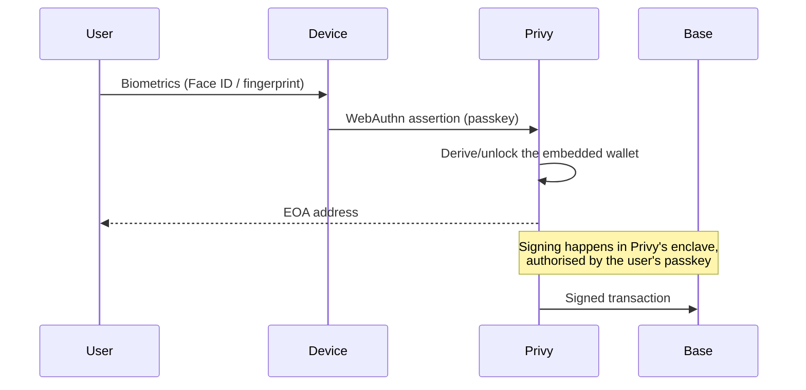

## The identity flow

Users pick no password and write down no seed phrase. They register a
**passkey** — the device's own WebAuthn credential, protected by biometrics or
the OS PIN.

The wallet is a plain **EOA** (externally owned account) on Base, provisioned
by [Privy](https://privy.io) on first login
(`createOnLogin: users-without-wallets`). At this stage we do **not** use Smart
Wallets / ERC-4337 — it is a standard EOA, which keeps the wallet legible and
usable by any EVM tool.

<Callout title="Login is passkey and nothing else">
Privy is configured with `loginMethods: ["passkey"]`. There is no email, SMS or
social login. The login screen is our own pt-BR implementation — Privy's
default modal isn't used because it cannot be localised.
</Callout>

## Why Conta cannot move your balance

The private key never exists in cleartext on a Conta server. It is managed by
Privy's infrastructure and is only usable against the user's passkey
assertion. Our backend has no path — and can obtain no path — to sign on a
user's behalf.

Concretely, this means **every** outflow from a user's balance — sending PIX,
paying a QR code, transferring to another user, funding a money link — starts
with a transaction the **user** signs on their device. The server only steps in
afterwards, to observe that transaction on-chain and fire the corresponding
fiat leg.

One consequence worth stating plainly: if a user loses every device holding
the registered passkey, recovery depends on Privy's and the operating system's
mechanisms (synced keychain, iCloud/Google), not on a button on our side. Real
self-custody has that cost, and it is explicit.

## Gas sponsorship

Users do not need to hold ETH to use Conta. The user's on-chain BRLA
transfers — off-ramp, QR-pay, P2P send — can have gas **sponsored** by Conta,
through Privy's gas sponsorship mechanism (executed in a TEE).

That changes who pays the network fee. It does **not** change who signs: the
transaction is still authorised by the user's passkey. Sponsoring gas grants
Conta no power to move funds.

## Accounts and addresses

| Element | Controlled by | Role |
| --- | --- | --- |
| User wallet (EOA on Base) | The user, via passkey | Where the BRLA balance lives |
| Conta's Hodle wallet | Conta (operational) | PIX↔BRLA conversion funnel and money-link escrow |
| Sponsored on-ramp wallet | Conta (operational) | Receives Hodle's net delivery and forwards the full amount to the user |
| Treasury | Conta | Receives fees from the dollar rails |

The last three are our operational wallets, holding float — money in transit
or working capital. None of them holds user balance at rest. See
[Security](/en/docs/seguranca) for what this implies for the threat model.
