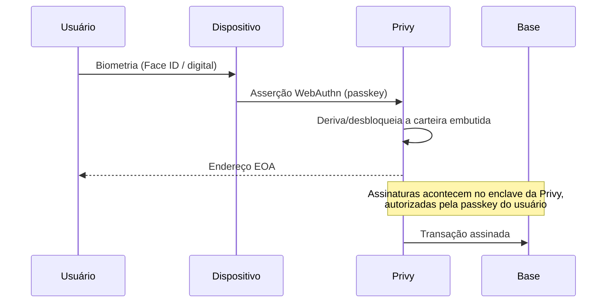

## O fluxo de identidade

O usuário não escolhe senha nem anota seed phrase. Ele registra uma
**passkey** — a credencial WebAuthn do próprio dispositivo, protegida por
biometria ou PIN do sistema operacional.

A carteira é uma **EOA comum** (conta de propriedade externa) na Base,
provisionada pela [Privy](https://privy.io) no primeiro login
(`createOnLogin: users-without-wallets`). Nesta fase **não** usamos Smart
Wallets / ERC-4337 — é uma EOA padrão, o que mantém a carteira legível e
utilizável por qualquer ferramenta EVM.

<Callout title="Login é passkey e só passkey">
O Privy está configurado com `loginMethods: ["passkey"]`. Não há login por
e-mail, SMS ou social. A tela de login é uma implementação própria em pt-BR —
o modal padrão do Privy não é usado porque não permite localização.
</Callout>

## Por que a Conta não consegue mover seu saldo

A chave privada nunca existe em texto claro num servidor da Conta. Ela é
gerenciada pela infraestrutura da Privy e só é utilizável mediante a asserção
da passkey do usuário. Nosso backend não tem, e não pode obter, uma via de
assinar em nome de um usuário.

Concretamente, isto significa que **toda** saída de saldo do usuário — enviar
PIX, pagar um QR, transferir para outro usuário, financiar um money link —
começa com uma transação que o **usuário** assina no dispositivo dele. O
servidor só entra depois, para observar essa transação on-chain e disparar a
etapa correspondente em real.

Uma consequência que vale enunciar: se o usuário perder todos os dispositivos
com a passkey registrada, a recuperação depende dos mecanismos da Privy e do
sistema operacional (chaveiro sincronizado, iCloud/Google), não de um botão
nosso. Autocustódia real tem esse custo, e ele é explícito.

## Patrocínio de gás

O usuário não precisa ter ETH para usar a Conta. As transferências on-chain de
BRLA do usuário — off-ramp, QR-pay, envio P2P — podem ter o gás **patrocinado**
pela Conta, via o mecanismo de gas sponsorship da Privy (executado em TEE).

Isso muda quem paga a taxa de rede. **Não** muda quem assina: a transação
continua sendo autorizada pela passkey do usuário. Patrocinar gás não confere
à Conta nenhum poder de mover fundos.

## Contas e endereços

| Elemento | Quem controla | Papel |
| --- | --- | --- |
| Carteira do usuário (EOA em Base) | O usuário, via passkey | Onde o saldo BRLA fica |
| Carteira Hodle da Conta | A Conta (operacional) | Funil de conversão PIX↔BRLA e escrow de money links |
| Carteira de on-ramp patrocinado | A Conta (operacional) | Recebe a entrega líquida da Hodle e encaminha o valor cheio ao usuário |
| Treasury | A Conta | Recebe as taxas das rails de dólares |

As três últimas são carteiras operacionais nossas, com float — dinheiro em
trânsito ou capital de giro. Nenhuma delas guarda saldo de usuário em repouso.
Veja [Segurança](/docs/seguranca) para o que isso implica em modelo de ameaça.
