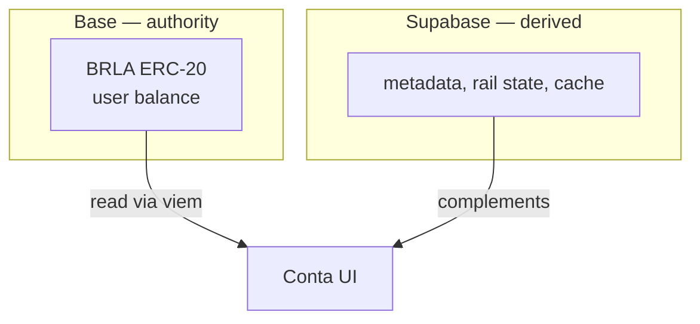

Every technical decision at Conta resolves against four principles. They are
not aspirational — when one conflicts with a product convenience, the
convenience is what gives.

## 1. Truth on the chain, cache in the database

The user's real balance is always read on-chain, over a Base RPC, using
[viem](https://viem.sh). Supabase holds **metadata, rail state and cache** —
never the authority over how much someone owns.

The consequence is that no accounting bug of ours can create or destroy a
balance. If Conta's entire database were wiped, balances would still exist and
remain accessible: they are ERC-20 token positions in users' own wallets.

## 2. Minimal backend

There is almost no business logic in the Next server. The backend serves three
purposes, and only three:

1. **Receive the Hodle webhook** — the single asynchronous entry point.
2. **Securely proxy external APIs** — so API keys never reach the client.
3. **Fast cache reads** — so rendering doesn't depend on an RPC round-trip.

Less server surface means less surface to compromise, and less code capable of
moving money.

## 3. Custody never touches the backend

No user private key ever passes through a Conta server. This is detailed in
[Custody and keys](/en/docs/arquitetura/custodia).

Conta's operational wallet at Hodle — which doubles as the escrow for money
links — is an **in-transit funnel**, not user custody. Money passes through it
for seconds or minutes during a conversion; it never sits there as "customer
balance".

<Callout type="warn" title="A distinction that matters">
"Conta has an operational wallet" and "Conta custodies user balances" are
different claims. The first is true and necessary in order to convert between
PIX and BRLA. The second is false.
</Callout>

## 4. Visible failure

Payment systems fail. What distinguishes a good one is what it does when it
doesn't know whether something happened.

Conta's rule: **ambiguous states never self-recover.** When there is a crash
between broadcasting an on-chain transaction and persisting the result — or
between firing a payout at Hodle and recording its id — the record **freezes**
in a terminal-but-not-terminal state (`firing`, `fulfilling`, `claiming`,
`recovering`) and waits for manual review.

The alternative would be to retry. Retrying, when you don't know whether the
first attempt went out, is exactly how double payments are produced. We prefer
a user waiting on a manual resolution to a user paid twice with money that
wasn't theirs.

This pairs with an explicit error discipline across integrations:

| Error type | Interpretation | Action |
| --- | --- | --- |
| API 4xx | Probably did **not** execute | Clean failure, released for retry |
| 5xx or network error | **Ambiguous** — may have executed | Freeze, never resend |
| Success | Executed | Persist the hash/id **before** any terminal transition |

## What this buys

A system where "what happens if Conta disappears tomorrow?" has a technical
answer rather than a legal one: users keep their balance, because the balance
was never with us.
