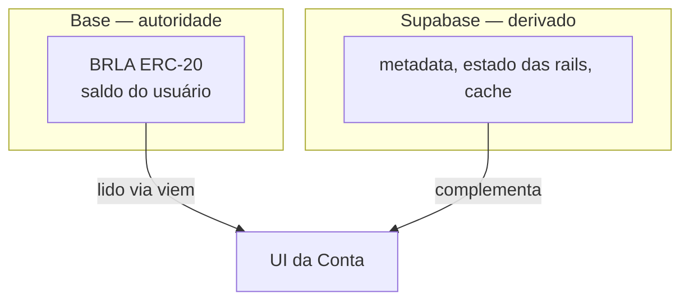

Toda decisão técnica da Conta se resolve por quatro princípios. Eles não são
aspiracionais — quando um deles conflita com uma conveniência de produto, é a
conveniência que cai.

## 1. Verdade na chain, cache no banco

O saldo real do usuário é sempre lido on-chain, via RPC da Base, com
[viem](https://viem.sh). O Supabase guarda **metadata, estado das rails e
cache** — nunca a autoridade sobre quanto alguém tem.

A consequência é que nenhum bug nosso de contabilidade pode criar ou destruir
saldo. Se o banco de dados da Conta fosse apagado inteiro, os saldos
continuariam existindo e acessíveis: eles são posições de um token ERC-20 nas
carteiras dos usuários.

## 2. Backend minimalista

Quase não existe lógica de negócio no servidor Next. O backend serve a três
propósitos, e só:

1. **Receber o webhook da Hodle** — o único ponto de entrada assíncrono.
2. **Proxy seguro para APIs externas** — para que chaves de API nunca cheguem
   ao cliente.
3. **Leitura rápida de cache** — para não depender de RPC em toda renderização.

Menos superfície no servidor significa menos superfície para comprometer, e
menos código capaz de mover dinheiro.

## 3. Custódia nunca toca o backend

Nenhuma chave privada de usuário passa por servidor da Conta. Isso é detalhado
em [Custódia e chaves](/docs/arquitetura/custodia).

A carteira operacional da Conta na Hodle — que também funciona como escrow dos
money links — é um **funil de fundos em trânsito**, não custódia de usuário.
Dinheiro passa por ela por segundos ou minutos durante uma conversão; nunca
fica lá como "saldo do cliente".

<Callout type="warn" title="Distinção que importa">
"A Conta tem uma carteira operacional" e "a Conta custodia o saldo dos
usuários" são afirmações diferentes. A primeira é verdadeira e necessária para
converter entre PIX e BRLA. A segunda é falsa.
</Callout>

## 4. Falha visível

Sistemas de pagamento falham. O que distingue um bom sistema é o que ele faz
quando não sabe se algo aconteceu.

A regra da Conta: **estados ambíguos nunca se auto-recuperam.** Quando há um
crash entre o broadcast de uma transação on-chain e a persistência do
resultado — ou entre disparar um pagamento na Hodle e registrar o id dele — o
registro **congela** num estado terminal-não-terminal (`firing`, `fulfilling`,
`claiming`, `recovering`) e espera revisão manual.

A alternativa seria tentar de novo. Tentar de novo, quando não se sabe se a
primeira tentativa saiu, é como se produz pagamento duplicado. Preferimos um
usuário esperando uma resolução manual a um usuário pago duas vezes com
dinheiro que não era dele.

Isso se combina com uma disciplina explícita de erros nas integrações:

| Tipo de erro | Interpretação | Ação |
| --- | --- | --- |
| Erro 4xx da API | Provavelmente **não** executou | Falha limpa, libera para retry |
| Erro 5xx ou de rede | **Ambíguo** — pode ter executado | Congela, nunca reenvia |
| Sucesso | Executou | Persiste o hash/id **antes** de qualquer transição terminal |

## O que isso produz

Um sistema em que a pergunta "o que acontece se a Conta sumir amanhã?" tem uma
resposta técnica e não jurídica: os usuários continuam com o saldo, porque o
saldo nunca esteve conosco.
