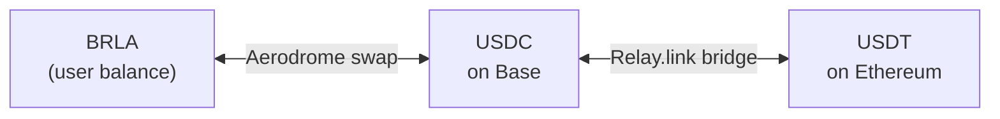

The user's balance is in BRLA. "Send dollars" and "receive dollars" do not
change that: they add an **on-chain swap** at the edges, converting between
BRLA and USDC at the moment of the operation.

## The base route

The swap happens in an **Aerodrome Slipstream** (concentrated liquidity)
BRLA/USDC pool on Base. USDT on Ethereum is the same route plus a bridge.

## The pool and its periphery

One integration detail worth recording, because it cost time: Aerodrome has
**three** Slipstream factories on Base, and the periphery is factory-bound — a
router or quoter only sees pools minted by its own factory.

The BRLA/USDC pool lives on the "Gauge Caps" factory. Using the 2023 canonical
factory's router against this pool **reverts**.

| Component | Address (Base mainnet) |
| --- | --- |
| BRLA/USDC pool | `0x1c33Aa5CC206Ed3d9E29fB136796A8815e48Af58` |
| Factory (Gauge Caps) | `0xaDe65c38CD4849aDBA595a4323a8C7DdfE89716a` |
| SwapRouter | `0xcbBb8035cAc7D4B3Ca7aBb74cF7BdF900215Ce0D` |
| QuoterV2 | `0x3d4C22254F86f64B7eC90ab8F7aeC1FBFD271c6C` |

The router keys the pool by `tickSpacing` (`10`), which is a Slipstream
`int24` — **not** Uniswap V3's `uint24 fee`. Swapping one for the other is a
silent mistake that only surfaces at runtime.

## Slippage

The swap uses a default tolerance of **50 bps (0.5%)**, configurable. Being
concentrated liquidity on a stable pair, execution usually lands well inside
that — but the protection is there for moments when the pool is thin.

## USDT on Ethereum

For dollars on Ethereum, the route gains a bridge operated by
[Relay.link](https://relay.link) solvers:

- **Send:** BRLA → USDC on Base → bridge → USDT on Ethereum, at the
  destination address.
- **Receive:** the user deposits USDT on Ethereum → bridge back to USDC on
  Base → swap to BRLA.

| Constant | Value |
| --- | --- |
| USDT contract (Ethereum) | `0xdac17f958d2ee523a2206206994597c13d831ec7` |
| Chain ID | `1` |
| Decimals | `6` |

USDT is a non-standard ERC-20 (its `approve` has its own behaviour); the
integration handles that by using calldata supplied by Relay rather than
assembling the call by hand.

## Availability

<Callout title="Rails behind a master switch">
All four dollar rails — send USDC, receive USDC, send USDT, receive USDT —
depend on the BRLA/USDC pool being configured. Without that configuration they
are simply **absent** from the interface: no error, no log.
</Callout>

In addition:

- Slipstream **only exists on mainnet**. There is no Base Sepolia deployment,
  so the dollar rails are production-only.
- The Ethereum USDT receive tab has its own additional switch, kept off until
  gas sponsorship on chain 1 is confirmed.

## Fees

The dollar rails charge a Conta fee, collected at the treasury address. If that
address is not configured, the fee is waived — the system never charges without
somewhere to send it.
