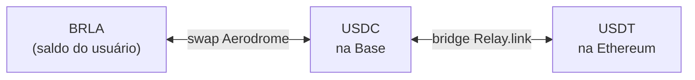

O saldo do usuário é em BRLA. "Enviar dólares" e "receber dólares" não mudam
isso: eles adicionam um **swap on-chain** nas bordas, convertendo entre BRLA e
USDC no momento da operação.

## A rota base

O swap acontece num pool **Aerodrome Slipstream** (liquidez concentrada) de
BRLA/USDC na Base. USDT na Ethereum é a mesma rota mais uma ponte.

## O pool e a periferia

Um detalhe de integração que vale registrar, porque custou tempo: a Aerodrome
tem **três** fábricas Slipstream na Base, e a periferia é vinculada à fábrica —
um router ou quoter só enxerga pools criados pela própria fábrica.

O pool BRLA/USDC vive na fábrica "Gauge Caps". Usar o router da fábrica
canônica de 2023 contra esse pool **reverte**.

| Componente | Endereço (Base mainnet) |
| --- | --- |
| Pool BRLA/USDC | `0x1c33Aa5CC206Ed3d9E29fB136796A8815e48Af58` |
| Fábrica (Gauge Caps) | `0xaDe65c38CD4849aDBA595a4323a8C7DdfE89716a` |
| SwapRouter | `0xcbBb8035cAc7D4B3Ca7aBb74cF7BdF900215Ce0D` |
| QuoterV2 | `0x3d4C22254F86f64B7eC90ab8F7aeC1FBFD271c6C` |

O pool é identificado pelo router através do `tickSpacing` (`10`), que é um
`int24` do Slipstream — **não** o `uint24 fee` do Uniswap V3. Trocar um pelo
outro é um erro silencioso que só aparece em runtime.

## Slippage

O swap usa uma tolerância padrão de **50 bps (0,5%)**, configurável. Como é
liquidez concentrada num par estável, a execução tende a ficar bem dentro
disso — mas a proteção existe para o caso de o pool estar raso no momento.

## USDT na Ethereum

Para dólares na Ethereum, a rota ganha uma ponte operada pelos solvers da
[Relay.link](https://relay.link):

- **Enviar:** BRLA → USDC na Base → ponte → USDT na Ethereum, no endereço de
  destino.
- **Receber:** o usuário deposita USDT na Ethereum → ponte de volta para USDC
  na Base → swap para BRLA.

| Constante | Valor |
| --- | --- |
| Contrato USDT (Ethereum) | `0xdac17f958d2ee523a2206206994597c13d831ec7` |
| Chain ID | `1` |
| Casas decimais | `6` |

O USDT é um ERC-20 não padrão (o `approve` tem comportamento próprio); a
integração lida com isso usando a calldata fornecida pela própria Relay em vez
de montar a chamada à mão.

## Disponibilidade

<Callout title="Rails com chave geral">
As quatro rails de dólares — enviar USDC, receber USDC, enviar USDT, receber
USDT — dependem do pool BRLA/USDC estar configurado. Sem essa configuração
elas ficam simplesmente **ausentes** da interface: sem erro e sem log.
</Callout>

Além disso:

- O Slipstream **só existe em mainnet**. Não há deploy em Base Sepolia, então
  as rails de dólares são exclusivas de produção.
- A aba de receber USDT na Ethereum tem uma trava adicional própria, mantida
  desligada até o patrocínio de gás na chain 1 estar confirmado.

## Taxas

As rails de dólares cobram uma taxa da Conta, recolhida no endereço de
treasury. Se o endereço não estiver configurado, a taxa é dispensada — o
sistema nunca cobra sem ter para onde mandar.
