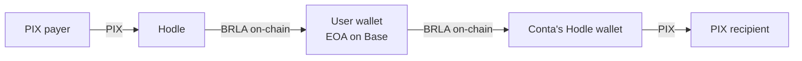

Conta is a **self-custodial Brazilian payments account**. Users send and
receive PIX — Brazil's instant payment system — as usual, but the balance is
not a number in a database we control. It is a balance in **BRLA**, a
stablecoin backed 1:1 by the Brazilian real, held on-chain in the **user's own
wallet** on **Base**.

The practical difference fits in one sentence:

<Callout title="The core guarantee">
Conta never holds the user's private key and therefore never holds their
money. This is not an internal policy promise — it is a consequence of the
architecture, verifiable on-chain by anyone.
</Callout>

## Who this is for

For people who would rather audit the claim above than take it on faith. It
describes how the product actually works: the custody model, how each PIX rail
executes, what happens when something fails midway, and which technology
choices hold it all up.

This is not a public API reference — Conta does not currently expose an API to
third parties. It is a description of how the system works internally.

## The four facts that define the system

<Cards>
  <Card title="Passkey authentication" description="No password, no seed phrase. The wallet key is created and used via Privy, gated by device biometrics." />
  <Card title="On-chain balance" description="BRLA (ERC-20, 18 decimals, 1:1 BRL) on Base, in the user's own EOA. The displayed balance is read from the chain, not from a database." />
  <Card title="Real PIX on both ends" description="Money enters and leaves over PIX through Hodle, which converts between reais and BRLA at the edges of the system." />
  <Card title="Visible failure, never silent" description="Ambiguous states freeze for manual review rather than risk a double payment." />
</Cards>

## How money crosses the system

The middle segment — the user's wallet — is the only place money sits still,
and it is not ours. The ends are in-transit conversion funnels, not custody.

## Where to start

<Cards>
  <Card href="/en/docs/arquitetura" title="Architecture" description="Principles, custody model, and what lives on-chain versus in the database." />
  <Card href="/en/docs/rails" title="PIX rails" description="On-ramp, off-ramp, QR-pay, P2P and money links — step by step, failure modes included." />
  <Card href="/en/docs/seguranca" title="Security" description="Threat model, on-chain verifiable addresses, and what a compromise of Conta would and would not allow." />
  <Card href="/en/docs/stack" title="Stack" description="The technologies used and the reasoning behind each choice." />
</Cards>
