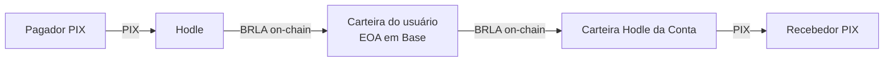

A Conta é uma **conta de pagamentos brasileira autocustodial**. O usuário paga
e recebe PIX normalmente, mas o saldo não é um número num banco de dados
nosso: é um saldo em **BRLA** — stablecoin lastreada 1:1 em real — que vive
on-chain, na **carteira do próprio usuário**, na rede **Base**.

A diferença prática cabe em uma frase:

<Callout title="A garantia central">
A Conta nunca tem posse da chave privada do usuário e, portanto, nunca tem
posse do dinheiro dele. Isso não é uma promessa de política interna — é uma
consequência da arquitetura, verificável on-chain por qualquer pessoa.
</Callout>

## Para quem é esta documentação

Para quem prefere auditar a afirmação acima a aceitá-la. Ela descreve o
funcionamento interno do produto: o modelo de custódia, como cada rail de PIX
executa, o que acontece quando algo falha no meio do caminho e quais escolhas
de tecnologia sustentam tudo isso.

Não é uma referência de API pública — a Conta hoje não expõe API para
terceiros. É a descrição de como o sistema funciona por dentro.

## Os quatro fatos que definem o sistema

<Cards>
  <Card title="Autenticação por passkey" description="Sem senha e sem seed phrase. A chave da carteira é criada e usada via Privy, atrás da biometria do dispositivo." />
  <Card title="Saldo on-chain" description="BRLA (ERC-20, 18 casas, 1:1 BRL) na Base, na carteira EOA do usuário. O saldo exibido é lido da chain, não de um banco." />
  <Card title="PIX real nas duas pontas" description="O dinheiro entra e sai por PIX através da Hodle, que converte entre real e BRLA nas bordas do sistema." />
  <Card title="Falha visível, nunca silenciosa" description="Estados ambíguos congelam para revisão manual em vez de arriscar um pagamento duplicado." />
</Cards>

## Como o dinheiro atravessa o sistema

O trecho do meio — a carteira do usuário — é o único lugar onde o dinheiro
fica parado, e ele não é nosso. As pontas são funis de conversão em trânsito,
não custódia.

## Por onde começar

<Cards>
  <Card href="/docs/arquitetura" title="Arquitetura" description="Princípios, modelo de custódia e o que vive on-chain versus no banco." />
  <Card href="/docs/rails" title="Rails PIX" description="On-ramp, off-ramp, QR-pay, P2P e money links — passo a passo, com os modos de falha." />
  <Card href="/docs/seguranca" title="Segurança" description="Modelo de ameaça, endereços verificáveis on-chain e o que um comprometimento nosso permitiria — e o que não." />
  <Card href="/docs/stack" title="Stack" description="As tecnologias usadas e o motivo de cada escolha." />
</Cards>
