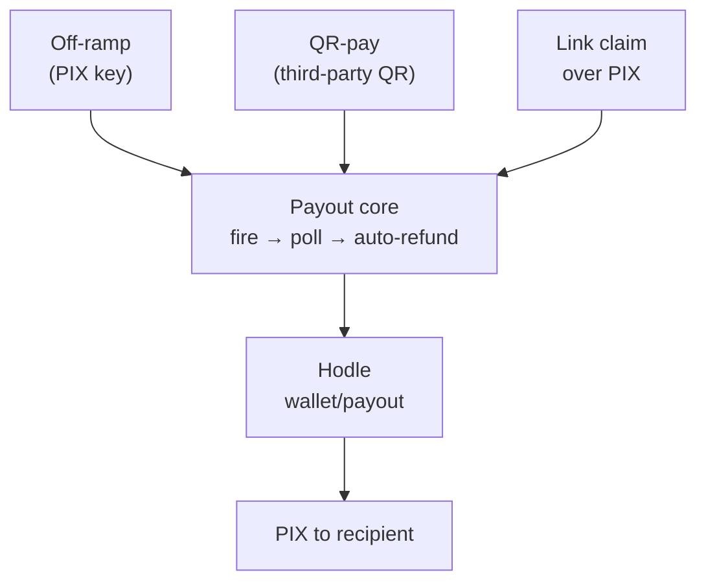

A **rail** is a complete route money can take. Conta has five, and the most
important distinction between them is simple: **which ones touch the PIX
system and which are purely on-chain.**

| Rail | Route | Touches PIX? |
| --- | --- | --- |
| [On-ramp](/en/docs/rails/onramp) | PIX → BRLA in the user's wallet | Yes (inbound) |
| [Off-ramp](/en/docs/rails/offramp) | BRLA → PIX to a key | Yes (outbound) |
| [QR-pay](/en/docs/rails/offramp#qr-pay) | BRLA → PIX to a third-party QR | Yes (outbound) |
| [P2P and internal QR](/en/docs/rails/p2p-links) | BRLA → BRLA between users | **No** |
| [Money links](/en/docs/rails/p2p-links#money-links) | BRLA in escrow → account or PIX | Depends on the claim |

The rails that touch PIX go through [Hodle](https://hodle.com.br)
(`api.hodle.com.br`), which converts between reais and BRLA. The ones that
don't are direct ERC-20 transfers: instant and with no intermediary fee.

## The shared core

Off-ramp, QR-pay and PIX money-link claims are three different products to the
user, but technically they are **the same rail** with different origins. They
all converge on a common payout core.

Concentrating this in one place is deliberate: the delicate logic — verifying
on-chain funding before firing, handling retries, telling a clean failure apart
from an ambiguous one, returning the money when the PIX fails — exists **once**,
not as three variants that drift apart over time.

## The order that never inverts

On every outbound rail the sequence is rigid:

<Steps>
<Step>
### The user signs and transfers

BRLA leaves the user's wallet for Conta's Hodle wallet. This is the only step
that requires the passkey.
</Step>

<Step>
### The server verifies on-chain

The transfer is **verified** against the chain — amount, recipient and
receipt — before anything happens in fiat. The hash is consumed by an atomic
guard so the same transaction can never fund two operations.
</Step>

<Step>
### Only then is the PIX fired

The Hodle payout is created only after verification passes.
</Step>
</Steps>

A PIX is never fired on the assumption that the user actually paid. The proof
is always on-chain.

## Fees and sponsorship

Hodle charges a fee on every PIX operation. Conta can **absorb** that fee
through an operational toggle (`app_settings.sponsor_hodle_fees`, on by
default).

With sponsorship on, the user receives or pays **100% of the nominal amount** —
the fee line in the interface reads "Grátis" (free), and float in Conta's
operational wallet covers the difference. With it off, the fee is added on top
of what the user must send.

<Callout title="Fails to the safe side">
If reading the toggle fails, the system degrades to **off** — it goes back to
charging the user. That is intentional: a read failure should never blindly
drain Conta's float.
</Callout>

The quote is frozen when the operation is created and persisted on the row
itself. Flipping the toggle mid-flight never changes the rules of an operation
already in progress.
