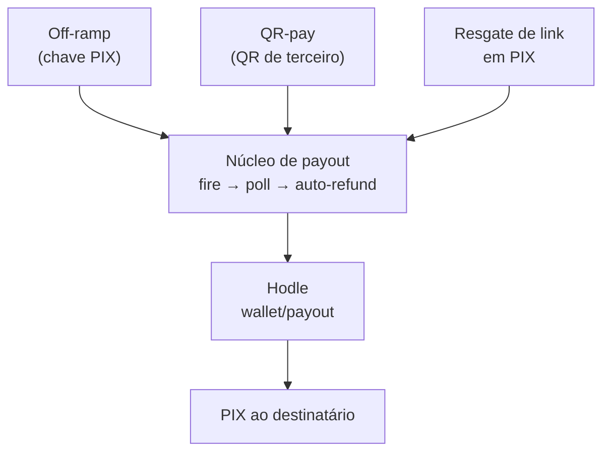

Uma **rail** é uma rota completa que o dinheiro pode tomar. A Conta tem cinco,
e a distinção mais importante entre elas é simples: **quais tocam o sistema
PIX e quais são puramente on-chain.**

| Rail | Rota | Passa por PIX? |
| --- | --- | --- |
| [On-ramp](/docs/rails/onramp) | PIX → BRLA na carteira do usuário | Sim (entrada) |
| [Off-ramp](/docs/rails/offramp) | BRLA → PIX para uma chave | Sim (saída) |
| [QR-pay](/docs/rails/offramp#qr-pay) | BRLA → PIX para um QR de terceiro | Sim (saída) |
| [P2P e QR interno](/docs/rails/p2p-links) | BRLA → BRLA entre usuários | **Não** |
| [Money links](/docs/rails/p2p-links#money-links) | BRLA em escrow → conta ou PIX | Depende do resgate |

As rails que tocam PIX passam pela [Hodle](https://hodle.com.br)
(`api.hodle.com.br`), que faz a conversão entre real e BRLA. As que não tocam
são transferências ERC-20 diretas: instantâneas e sem taxa de intermediário.

## O núcleo compartilhado

Off-ramp, QR-pay e resgate de money link em PIX são três produtos diferentes
para o usuário, mas do ponto de vista técnico são **a mesma rail** com origens
distintas. Todas convergem para um núcleo comum de payout.

Concentrar isso num único lugar é deliberado: a lógica delicada — verificar o
financiamento on-chain antes de disparar, tratar retentativa, distinguir falha
limpa de falha ambígua, devolver o dinheiro quando o PIX falha — existe **uma
vez**, e não em três variações que divergem com o tempo.

## A ordem que nunca inverte

Em toda rail de saída, a sequência é rígida:

<Steps>
<Step>
### O usuário assina e transfere

O BRLA sai da carteira do usuário para a carteira Hodle da Conta. Esta é a
única etapa que exige a passkey.
</Step>

<Step>
### O servidor verifica on-chain

A transferência é **verificada** contra a chain — valor, destinatário e recibo
— antes de qualquer coisa em real acontecer. O hash é consumido num guard
atômico para que a mesma transação nunca financie duas operações.
</Step>

<Step>
### Só então o PIX é disparado

O payout na Hodle só é criado depois da verificação passar.
</Step>
</Steps>

Nunca se dispara um PIX confiando que o usuário realmente pagou. A prova é
sempre on-chain.

## Taxas e patrocínio

A Hodle cobra taxa em cada operação de PIX. A Conta pode **absorver** essa
taxa através de um toggle operacional (`app_settings.sponsor_hodle_fees`,
ligado por padrão).

Com o patrocínio ligado, o usuário recebe ou paga **100% do valor nominal** —
a linha de taxa na interface mostra "Grátis", e o float da carteira
operacional da Conta cobre a diferença. Com ele desligado, a taxa é somada ao
valor que o usuário precisa enviar.

<Callout title="Falha para o lado seguro">
Se a leitura do toggle falhar, o sistema degrada para **desligado** — volta a
cobrar a taxa do usuário. A escolha é intencional: uma falha de leitura nunca
deve drenar o float da Conta às cegas.
</Callout>

A cotação é congelada na criação da operação e persistida na própria linha.
Trocar o toggle no meio de uma operação em voo não muda as regras dela.
