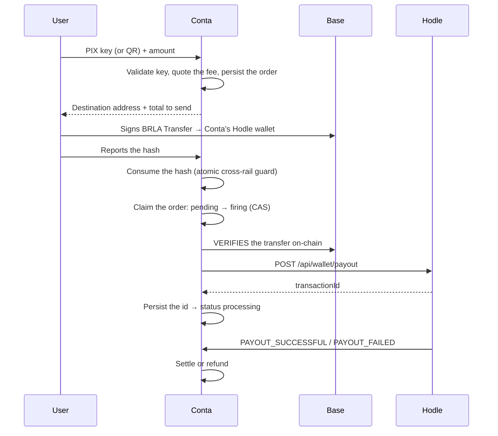

Off-ramp (sending to a PIX key) and QR-pay (paying a third-party QR code) are
the same mechanism with different destinations. This is the rail with the most
delicate logic in the system, because it is where a mistake produces **money
paid twice**.

## The flow

## The two locks before firing

Before any PIX is created, two independent claims must be won. Both exist
because of real failures, not hypothetical ones.

<Steps>
<Step>
### Cross-rail guard — the funding hash

The funding transaction's hash is consumed in a table where it is the
**primary key** (`consumed_funding_hashes`). That makes the claim atomic: the
same on-chain transaction can never fund both an off-ramp and a QR-pay, even
under a genuine race.

It is necessary because all three outbound rails — off-ramp, QR-pay and
money-link funding — deposit into **the same wallet**. Without the guard, a
reused hash would be indistinguishable from two legitimate fundings.
</Step>

<Step>
### Order claim — `pending → firing`

A compare-and-swap on the order itself guarantees that at most one execution
ever reaches the payout call.

This closes a specific hole: if the Hodle fire succeeded but persisting the
`transactionId` failed right after, a retry would be indistinguishable from
"never fired" — and a naive retry would re-verify and re-fire the PIX payout.
</Step>
</Steps>

## Funding verification

Verification checks the transfer against the chain: amount, recipient and
receipt. One detail matters: it checks against the **destination address stored
on the order itself**, not a live re-resolution of the Hodle wallet address.

That way, rotating the operational wallet mid-flight can never invalidate
verification of an order that was already issued.

## A retry that covers exactly one case

After the user's transfer confirms on-chain, Hodle still has to index that
credit into its internal ledger — and that is **asynchronous**. A payout fired
immediately can be rejected with "insufficient balance" even though the money
is already ours.

The retry covers **that specific rejection**, with growing backoff, and gives
up with a distinct state (`credit_timeout`) rather than a generic backend
error. The distinction is not cosmetic: it lets the caller know Hodle simply
hasn't caught up, instead of treating it as a real failure.

## Failure classification

| Situation | Proven **not** to have fired? | Result |
| --- | --- | --- |
| Funding unverified or timed out | Yes | Release both locks, clean retry |
| Limit or configuration error | Yes | Release both locks |
| `credit_timeout` | Yes | Release both locks |
| 5xx / network error while firing | **No** — may have created the payout | **Freeze**, wait for sweep or review |

## When the PIX fails

If Hodle settles as `FAILED`, it restores the full funding amount (value plus
its own fee) to our wallet. The refund then returns that same total to the
**user's own wallet**, as an on-chain transfer.

The user gets their money back as BRLA in their wallet — not as a credit in a
system of ours.

## Accepted PIX keys

All five types Hodle supports: **CPF, CNPJ, email, phone and random key**. The
type is detected from the format of the key entered.

## Limits

| Limit | Value |
| --- | --- |
| Minimum per payout | R$ 0.10 |
| Maximum per payout | R$ 1,000.00 (configurable) |

## QR-pay

Identical to the off-ramp with one difference: instead of a PIX key, the
destination is the `qrCode` (BR Code) the user scanned. The BR Code is parsed
locally to extract merchant and amount — including amountless QRs, where the
user types how much to pay.

<Callout title="Before paying via Hodle, Conta checks whether the QR is its own">
If the scanned QR is a "Receive" QR generated by another Conta user, the
payment is diverted to the on-chain P2P rail — instant and free. See
[P2P and money links](/en/docs/rails/p2p-links).
</Callout>
