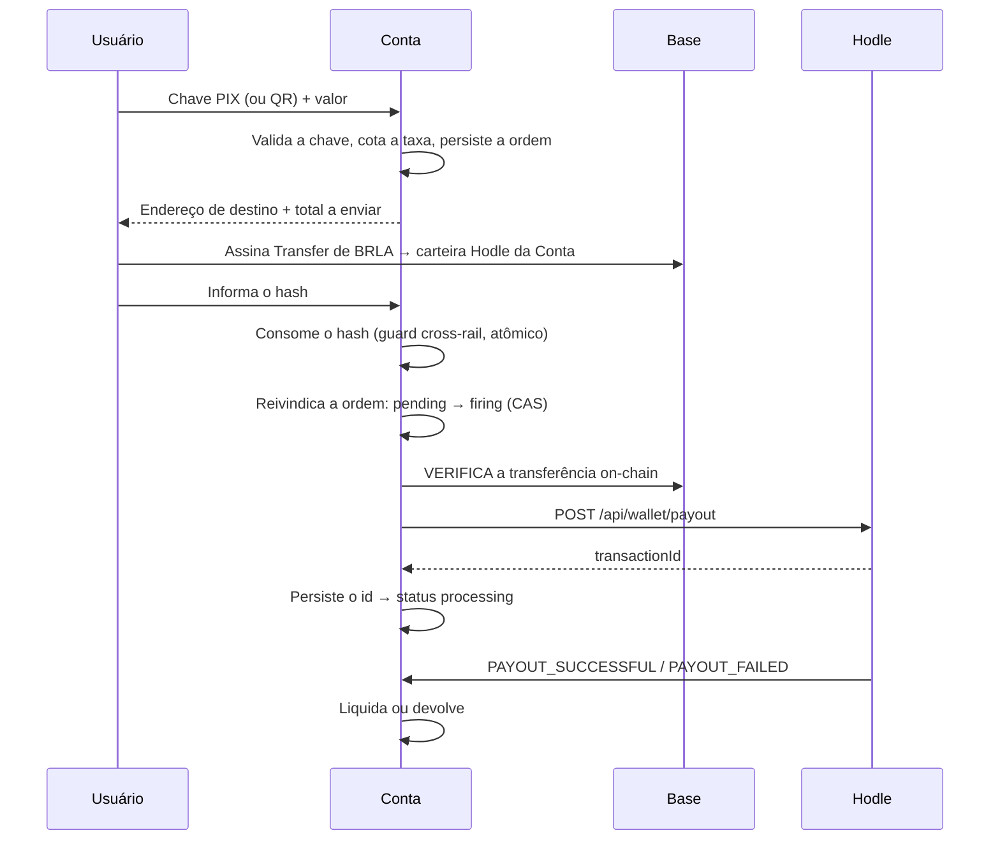

Off-ramp (enviar para uma chave PIX) e QR-pay (pagar um QR de terceiro) são o
mesmo mecanismo com destinos diferentes. Esta é a rail com a lógica mais
delicada do sistema, porque é onde um erro produz **dinheiro pago duas vezes**.

## O fluxo

## As duas travas antes do disparo

Antes de qualquer PIX ser criado, duas reivindicações independentes precisam
ser vencidas. As duas existem por causa de falhas reais, não hipotéticas.

<Steps>
<Step>
### Guard entre rails — o hash de financiamento

O hash da transação de financiamento é consumido numa tabela onde ele é a
**chave primária** (`consumed_funding_hashes`). Isso torna a reivindicação
atômica: a mesma transação on-chain nunca pode financiar simultaneamente um
off-ramp e um QR-pay, mesmo sob concorrência genuína.

É necessário porque as três rails de saída — off-ramp, QR-pay e financiamento
de money link — depositam **na mesma carteira**. Sem o guard, um hash reusado
seria indistinguível de dois financiamentos legítimos.
</Step>

<Step>
### Reivindicação da ordem — `pending → firing`

Um compare-and-swap na própria ordem garante que no máximo uma execução chegue
ao disparo do payout.

Isso fecha um buraco específico: se o disparo na Hodle desse certo mas a
persistência do `transactionId` falhasse logo depois, uma nova tentativa seria
indistinguível de "nunca disparou" — e um retry ingênuo re-verificaria e
re-disparia o PIX.
</Step>
</Steps>

## Verificação do financiamento

A verificação confere a transferência contra a chain: valor, destinatário e
recibo. Um detalhe importa: ela confere contra o **endereço de destino
armazenado na própria ordem**, não contra uma re-resolução ao vivo do endereço
da carteira Hodle.

Assim, uma rotação da carteira operacional no meio de uma ordem em voo nunca
invalida a verificação de uma ordem já emitida.

## Retentativa que só cobre um caso

Depois que a transferência do usuário confirma on-chain, a Hodle ainda precisa
indexar esse crédito no ledger interno dela — e isso é **assíncrono**. Um
payout disparado imediatamente pode ser rejeitado com "saldo insuficiente"
mesmo com o dinheiro já sendo nosso.

A retentativa cobre **exatamente essa rejeição**, com backoff crescente, e
desiste com um estado próprio (`credit_timeout`) em vez de "erro de backend".
A distinção não é cosmética: ela permite que quem chamou saiba que a Hodle
ainda não alcançou o crédito, em vez de tratar como falha real.

## Classificação de falhas

| Situação | Provou que **não** disparou? | Resultado |
| --- | --- | --- |
| Financiamento não verificado ou expirado | Sim | Libera as duas travas, retry limpo |
| Erro de limite ou configuração | Sim | Libera as duas travas |
| `credit_timeout` | Sim | Libera as duas travas |
| Erro 5xx / rede ao disparar | **Não** — pode ter criado o payout | **Congela**, aguarda varredura ou revisão |

## Quando o PIX falha

Se a Hodle liquidar como `FAILED`, ela restaura na nossa carteira o valor
integral do financiamento (valor + a taxa dela). O reembolso então devolve
esse mesmo total à **carteira do próprio usuário**, via transferência on-chain.

O usuário recebe o dinheiro de volta como BRLA na carteira dele — não como um
crédito num sistema nosso.

## Chaves PIX aceitas

Todos os cinco tipos suportados pela Hodle: **CPF, CNPJ, e-mail, telefone e
chave aleatória**. O tipo é detectado a partir do formato da chave informada.

## Limites

| Limite | Valor |
| --- | --- |
| Mínimo por payout | R$ 0,10 |
| Máximo por payout | R$ 1.000,00 (configurável) |

## QR-pay

Idêntico ao off-ramp, com uma diferença: em vez de uma chave PIX, o destino é
o `qrCode` (BR Code) lido pelo usuário. O BR Code é analisado localmente para
extrair estabelecimento e valor — inclusive QRs sem valor definido, em que o
usuário digita quanto pagar.

<Callout title="Antes de pagar via Hodle, a Conta checa se o QR é dela mesma">
Se o QR escaneado for um QR "Receber" gerado por outro usuário da Conta, o
pagamento é desviado para a rail P2P on-chain — instantânea e sem taxa. Veja
[P2P e money links](/docs/rails/p2p-links).
</Callout>
