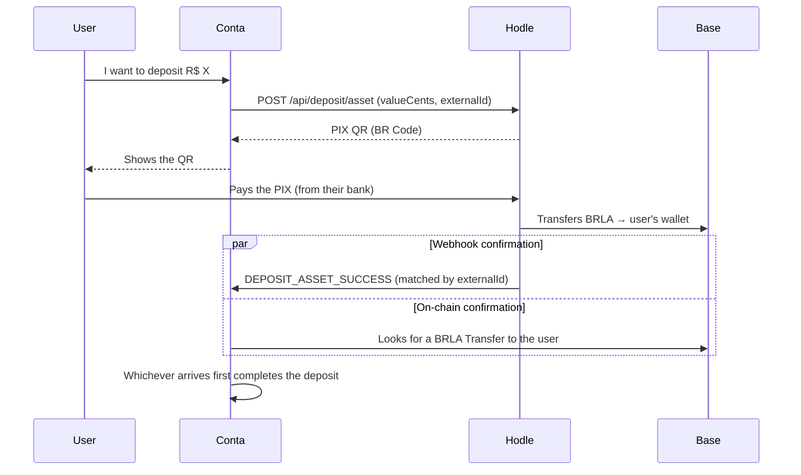
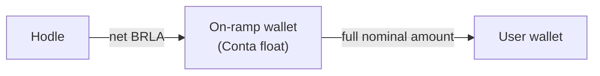

The on-ramp is Conta's simplest rail, and that is the result of an
architectural decision: **Hodle delivers BRLA straight to the user's wallet.**
There is no intermediary wallet and no second leg to orchestrate.

## The flow

## Two confirmation routes, deliberately redundant

The deposit completes on **either** of the two — whichever arrives first wins:

<Cards>
  <Card title="Webhook" description="Hodle sends DEPOSIT_ASSET_SUCCESS, matched to the deposit by the externalId we supplied at creation." />
  <Card title="On-chain discovery" description="The client polls status; the server scans Base for a BRLA Transfer to the user's wallet within the expected window and amount band." />
</Cards>

The redundancy is necessary because Hodle **delivers each webhook exactly
once, with no retries**. A lost webhook must not mean a lost deposit — hence
the independent route that observes the chain directly.

Completion is idempotent: the deposit row is claimed by compare-and-swap, so
the webhook and the poll can race each other without crediting twice.

## Time windows

| Parameter | Value | Meaning |
| --- | --- | --- |
| QR validity | 900 s (15 min) | After this the UI shows "expired" |
| Late-discovery window | +30 min | The reconciler keeps looking for a late credit |

The split between the two is intentional. PIX settlement can lag the QR's
nominal expiry; showing "expired" to the user while still completing a credit
that arrived late is better than stranding money that already came in.

## Matching by amount band

On-chain discovery does not look for an exact amount. It looks for a credit
within a band, because Hodle deducts its own fee from the delivered BRLA — the
amount that lands is normally **less** than the PIX amount paid.

The search also actively excludes:

- credits already pinned to **another** deposit;
- transfers from wallets known to belong to Conta (those are float top-ups,
  not user deposits).

When two active QRs share the same amount, the poll refuses to complete by
discovery — that ambiguity is resolved by the webhook, which carries the
`externalId` and is therefore proof of which deposit was paid.

## Sponsored on-ramp

When fee sponsorship is on, the path changes: Hodle delivers the **net** amount
to a dedicated Conta on-ramp wallet, which then forwards the **full** amount to
the user.

The user receives exactly what they paid; the difference comes out of float.
That wallet is dedicated to this single purpose and is never shared with any
other flow.

<Callout type="warn" title="If the forward becomes ambiguous">
The on-ramp-wallet → user forward is an on-chain transaction, and a crash
between broadcast and receipt confirmation is ambiguous. In that case the
deposit **freezes** in `fulfilling` and waits for manual review rather than
risking a second send. See [Principles](/en/docs/arquitetura).
</Callout>

The amount posted to the statement is the one **observed on-chain**, not the
nominal one — see [Data and ledger](/en/docs/arquitetura/dados).
