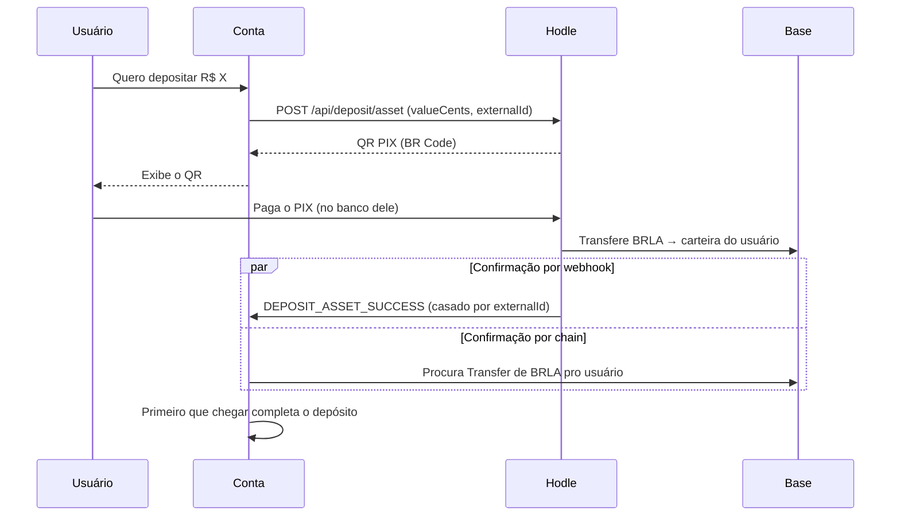
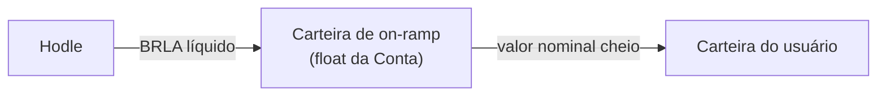

O on-ramp é a rail mais simples da Conta, e isso é resultado de uma decisão de
arquitetura: **a Hodle entrega o BRLA direto na carteira do usuário.** Não há
carteira intermediária, não há segunda perna para orquestrar.

## O fluxo

## Duas rotas de confirmação, deliberadamente redundantes

O depósito é concluído por **qualquer uma** das duas — o que chegar primeiro
vence:

<Cards>
  <Card title="Webhook" description="A Hodle envia DEPOSIT_ASSET_SUCCESS, casado com o depósito pelo externalId que enviamos na criação." />
  <Card title="Descoberta on-chain" description="O cliente faz poll de status; o servidor procura na Base um Transfer de BRLA para a carteira do usuário na janela e faixa de valor esperadas." />
</Cards>

A redundância é necessária porque a Hodle **entrega cada webhook exatamente
uma vez, sem retentativa**. Um webhook perdido não pode significar um depósito
perdido — daí a rota independente que observa a chain diretamente.

A conclusão é idempotente: a linha do depósito é reivindicada por
compare-and-swap, então webhook e poll podem correr um contra o outro sem
creditar duas vezes.

## Janelas de tempo

| Parâmetro | Valor | Significado |
| --- | --- | --- |
| Validade do QR | 900 s (15 min) | Depois disso a interface mostra "expirado" |
| Janela de descoberta tardia | +30 min | O reconciliador continua procurando um crédito atrasado |

A separação entre as duas é intencional. A liquidação do PIX pode atrasar em
relação à validade nominal do QR; mostrar "expirado" para o usuário e ainda
assim completar um crédito que chegou tarde é melhor do que abandonar dinheiro
que já entrou.

## Correspondência por faixa de valor

A descoberta on-chain não procura um valor exato. Ela procura um crédito
dentro de uma faixa, porque a Hodle deduz a taxa dela do BRLA entregue — o
valor que chega é normalmente **menor** que o valor do PIX pago.

A busca também exclui ativamente:

- créditos já vinculados a **outro** depósito;
- transferências vindas de carteiras conhecidas da própria Conta (que são
  recargas de float, não depósitos de usuário).

Quando existem dois QRs ativos do mesmo valor, o poll se recusa a concluir por
descoberta — a ambiguidade é resolvida pelo webhook, que carrega o
`externalId` e portanto é prova de qual depósito foi pago.

## On-ramp patrocinado

Quando o patrocínio de taxas está ligado, o percurso muda: a Hodle entrega o
valor **líquido** numa carteira dedicada de on-ramp da Conta, que então
encaminha o valor **cheio** para o usuário.

O usuário recebe exatamente o que pagou; a diferença sai do float. Essa
carteira é dedicada a esse único propósito e nunca é compartilhada com outro
fluxo.

<Callout type="warn" title="Se o encaminhamento ficar ambíguo">
O encaminhamento carteira-de-on-ramp → usuário é uma transação on-chain, e um
crash entre o broadcast e a confirmação do recibo é ambíguo. Nesse caso o
depósito **congela** em `fulfilling` e aguarda revisão manual, em vez de
arriscar um segundo envio. Ver [Princípios](/docs/arquitetura).
</Callout>

O valor lançado no extrato é o **observado on-chain**, não o nominal — veja
[Dados e ledger](/docs/arquitetura/dados).
