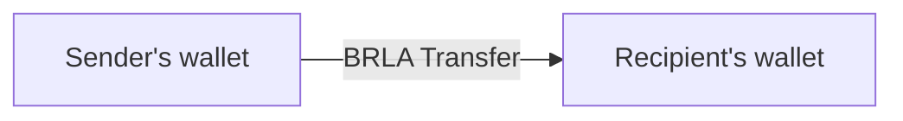
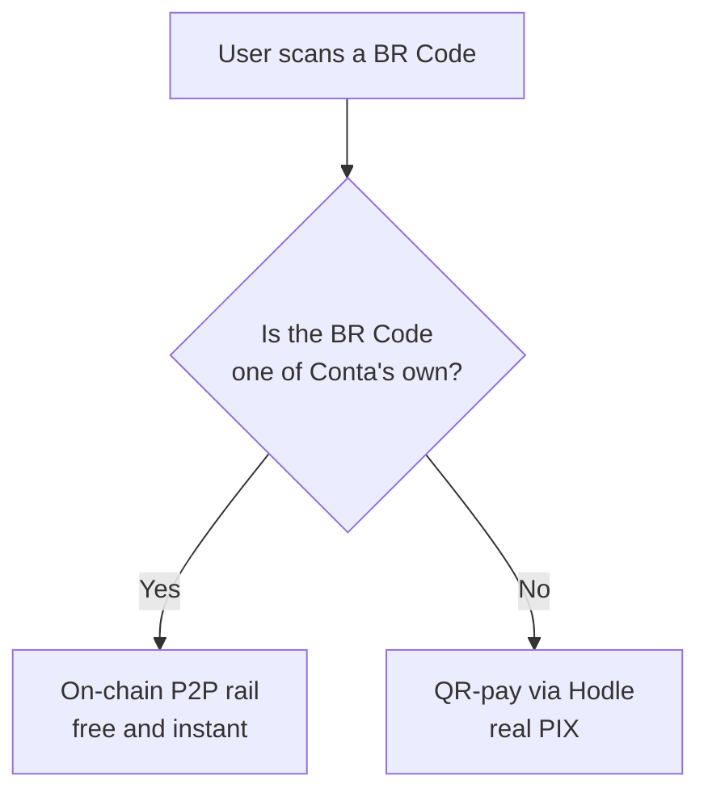

Not every payment needs to leave the chain. When both ends are Conta users,
money goes straight from wallet to wallet: an ordinary ERC-20 transfer, with no
intermediary and no rail fee.

## P2P by username

Every user can register a public username. Sending to `@someone` resolves the
username to a wallet address and performs a direct BRLA transfer.

There is no Hodle in the path, no PIX, no pending settlement. What the server
does is resolve the username, record the intent, and then verify the on-chain
transaction in order to post the statement entry on both sides.

## Internal QR — the divert

Here is an optimisation that is only possible because we know both sides.

When a user scans a QR to pay, Conta compares the **exact** BR Code against the
"Receive" QRs it generated itself. On a match, the destination is not the PIX
system — it is the wallet of whoever created the QR.

The user neither chooses nor notices the difference — except that the fee
disappears and it is faster.

If the check fails (a database hiccup, say), the system does **not** guess: it
falls back to the normal Hodle path. The cost is the fee the divert would have
saved; the risk of sending money to the wrong place is zero.

Some cases are rejected outright: paying your own QR, a QR already paid, or a
recipient whose wallet cannot receive.

## Money links

A money link is an amount of BRLA reserved behind a shareable URL. The creator
funds the link; the recipient claims it.

### The token is the credential

<Callout type="warn" title="A bearer instrument">
The URL **is** the credential. Whoever holds the link can claim it. That is the
same semantics as physical cash, and the product is designed on that
assumption.
</Callout>

The token carries 32 bytes of cryptographic randomness, encoded as base64url
(43 characters). The database stores **only the SHA-256** of the token — the
plaintext appears exactly once, in the creation response, and never in any log.

A breach of our database therefore does not let anyone claim links.

### The escrow

The escrow **is** Conta's Hodle wallet. There is no dedicated hot wallet for
links. Funding pays directly into that wallet, and every outflow — claim,
cancellation, refund — is a transfer out of it.

Because that is the same wallet that receives off-ramp and QR-pay funding,
activating a link consumes the hash under the same
[cross-rail guard](/en/docs/rails/offramp).

### Two ways to claim

<Cards>
  <Card title="To an account" description="The recipient is also a Conta user: a transfer from the escrow wallet to theirs." />
  <Card title="To a PIX key" description="The recipient needs no account: the claim enters the shared payout core and leaves as PIX." />
</Cards>

A PIX claim has no funding leg — the BRLA has been in the escrow wallet since
the link was funded, so the claim goes straight to firing the payout.

And when a PIX claim fails, the debit returns to the escrow wallet itself.
Recovery in that case **moves no money**: it simply reactivates the link so it
can be claimed again.

### Execution discipline

Only one invocation is authorised to move money: the one that just won the
claim, in the same request. Any later re-entry only **confirms** steps already
recorded — and a step that was not recorded means an ambiguous crash window,
which freezes rather than resending.
