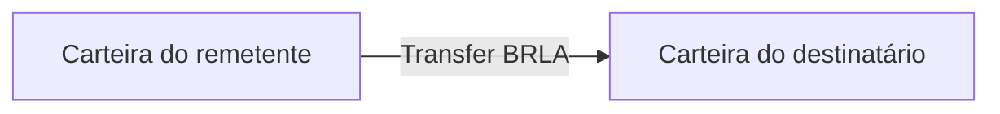
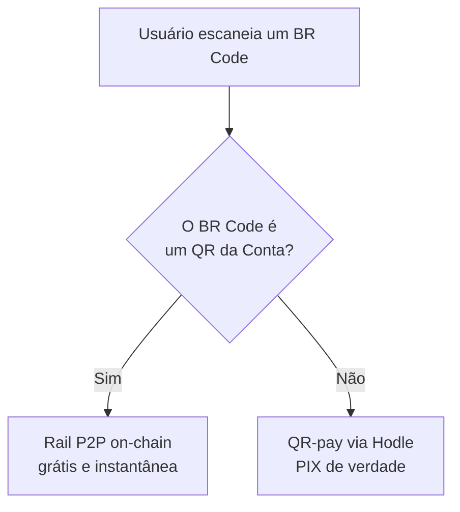

Nem todo pagamento precisa sair da chain. Quando as duas pontas são usuários da
Conta, o dinheiro vai direto de carteira para carteira: uma transferência
ERC-20 comum, sem intermediário e sem taxa de rail.

## P2P por username

Cada usuário pode registrar um username público. Enviar para `@fulano` resolve
o username para o endereço da carteira e faz uma transferência BRLA direta.

Não há Hodle no caminho, não há PIX, não há liquidação pendente. O que o
servidor faz é resolver o username, registrar a intenção e, depois, verificar
a transação on-chain para lançar o extrato dos dois lados.

## QR interno — o desvio

Aqui está uma otimização que só é possível porque conhecemos os dois lados.

Quando um usuário escaneia um QR para pagar, a Conta compara o BR Code
**exato** contra os QRs "Receber" que ela mesma gerou. Se der match, o destino
não é o sistema PIX — é a carteira de quem criou o QR.

O usuário não escolhe nem percebe a diferença — exceto pela taxa, que
desaparece, e pela velocidade.

Se a checagem falhar (por exemplo, uma indisponibilidade do banco), o sistema
**não** adivinha: cai no caminho normal via Hodle. O custo é a taxa que o
desvio teria economizado; o risco de errar o destino é zero.

Alguns casos são rejeitados explicitamente: pagar o próprio QR, um QR já pago,
ou um destinatário cuja carteira não pode receber.

## Money links

Um money link é um valor em BRLA reservado numa URL compartilhável. Quem cria
financia o link; quem recebe resgata.

### O token é a credencial

<Callout type="warn" title="Instrumento ao portador">
A URL **é** a credencial. Quem tiver o link pode resgatar. É a mesma semântica
de dinheiro em espécie, e o produto é desenhado assumindo isso.
</Callout>

O token tem 32 bytes de aleatoriedade criptográfica, codificados em base64url
(43 caracteres). O banco guarda **apenas o SHA-256** do token — o texto claro
aparece uma única vez, na resposta de criação, e nunca em log algum.

Um vazamento do nosso banco de dados, portanto, não permite resgatar links.

### O escrow

O escrow **é** a carteira Hodle da Conta. Não existe hot wallet dedicada a
links. O financiamento paga direto nessa carteira, e toda saída — resgate,
cancelamento, reembolso — é uma transferência a partir dela.

Como essa é a mesma carteira que recebe o financiamento de off-ramp e QR-pay,
a ativação de um link consome o hash no mesmo
[guard entre rails](/docs/rails/offramp).

### Duas formas de resgatar

<Cards>
  <Card title="Para uma conta" description="O destinatário também é usuário da Conta: uma transferência da carteira de escrow para a carteira dele." />
  <Card title="Para uma chave PIX" description="O destinatário não precisa ter conta: o resgate entra no núcleo de payout compartilhado e sai como PIX." />
</Cards>

O resgate em PIX não tem perna de financiamento — o BRLA já está na carteira de
escrow desde a criação do link, então ele vai direto para o disparo do payout.

E quando um resgate em PIX falha, o débito volta para a própria carteira de
escrow. A recuperação, nesse caso, **não move dinheiro**: apenas reativa o
link para que possa ser resgatado de novo.

### Disciplina de execução

Só uma invocação tem autorização para mover dinheiro: a que acabou de vencer a
reivindicação do resgate, no mesmo request. Qualquer reentrada posterior só
**confirma** etapas já registradas — e uma etapa não registrada significa uma
janela de crash ambígua, que congela em vez de reenviar.
