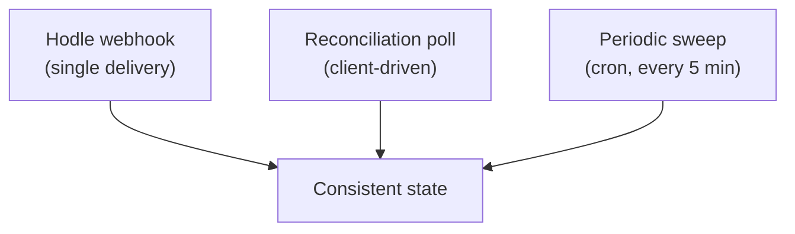

## The inconvenient fact

<Callout type="warn" title="Hodle delivers each webhook exactly once, with no retries">
A lost webhook is lost. There is no redelivery.
</Callout>

Conta's entire reconciliation design is a response to that. If webhooks were
reliable, half the machinery below would not exist.

## The receiver: record first, process after

`POST /api/hodle/webhook` is the single entry point. It:

1. **writes** the event to `webhook_events` before any processing;
2. answers **200** as soon as that write succeeds — even if the subsequent
   processing throws.

Answering 500 would buy nothing, since nobody resends. Better to record the
fact that the event arrived and leave convergence to mechanisms that do not
depend on delivery.

An event whose processing failed keeps `processed = false` and is reconciled
later.

## The three convergence layers

<Steps>
<Step>
### Webhook

The fast path. When it arrives, it resolves immediately.
</Step>

<Step>
### Reconciliation poll

While the user is watching the status screen, the client polls. Each call
reconciles the corresponding operation: re-queries the payout at Hodle, looks
for the credit on-chain, and completes if there is evidence.

This covers the common lost-webhook case — but only works while someone is
watching.
</Step>

<Step>
### Periodic sweep

A cron every 5 minutes re-checks **all** in-flight operations — off-ramp
orders, QR payments and PIX link claims — keyed off the Hodle transaction id.

This is the layer that depends neither on the webhook nor on a user keeping the
screen open. Without it, a payout for which Hodle simply never sent a webhook
would sit untouched until some unrelated event triggered a sweep.
</Step>
</Steps>

The cron route moves money, so it **fails closed**: without its authentication
secret configured, it refuses to run rather than executing unprotected.

## On webhook authentication

The receiver accepts three authentication schemes and only rejects when all
three fail: an HMAC-SHA256 signature with a timestamp, an authorization header
carrying a shared secret, or a token in the query string of the registered URL.

The plurality is pragmatic: webhook authentication on Hodle's side is opt-in,
and the documented HMAC scheme may not be active. Accepting any of the three
lets us use the strongest one available without breaking the integration.

Unknown events no-op and return 200.

## Frozen states

When neither the webhook nor reconciliation can determine what happened —
typically after an ambiguous error midway through firing — the operation sits
in a frozen state (`firing`, `fulfilling`, `claiming`, `recovering`).

Frozen states **never self-recover**. They exist to be seen by an operator, who
resolves them manually with the evidence in hand: checking the real state at
Hodle and on the chain before deciding.

That is the explicit price of the rule against resending under uncertainty. The
user waits; nobody gets paid twice.
