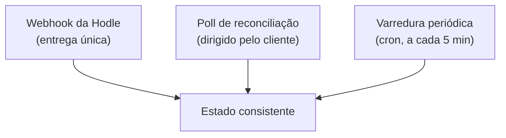

## O fato incômodo

<Callout type="warn" title="A Hodle entrega cada webhook exatamente uma vez, sem retentativa">
Um webhook perdido está perdido. Não existe reenvio.
</Callout>

Todo o desenho de reconciliação da Conta é uma resposta a isso. Se o webhook
fosse confiável, metade dos mecanismos abaixo não existiria.

## O receptor: registra primeiro, processa depois

`POST /api/hodle/webhook` é o único ponto de entrada. Ele:

1. **Grava** o evento em `webhook_events` antes de qualquer processamento;
2. responde **200** assim que essa gravação der certo — mesmo que o
   processamento posterior falhe.

Responder 500 não traria benefício nenhum, já que ninguém reenvia. Melhor
registrar o fato de que o evento chegou e deixar a convergência para os
mecanismos que não dependem de entrega.

Um evento cujo processamento falhou fica com `processed = false` e é
reconciliado depois.

## As três camadas de convergência

<Steps>
<Step>
### Webhook

O caminho rápido. Quando chega, resolve na hora.
</Step>

<Step>
### Poll de reconciliação

Enquanto o usuário olha a tela de status, o cliente faz poll. Cada chamada
reconcilia a operação correspondente: reconsulta o payout na Hodle, procura o
crédito na chain, e conclui se houver evidência.

Cobre o caso comum de webhook perdido — mas só funciona enquanto alguém está
olhando.
</Step>

<Step>
### Varredura periódica

Um cron a cada 5 minutos re-checa **todas** as operações em voo — ordens de
off-ramp, pagamentos de QR e resgates de link em PIX — usando o id de transação
da Hodle como chave.

Esta é a camada que não depende nem do webhook nem de o usuário estar com a
tela aberta. Sem ela, um payout para o qual a Hodle simplesmente nunca enviou
webhook ficaria parado até que outro evento não relacionado disparasse uma
varredura.
</Step>
</Steps>

A rota do cron move dinheiro, então ela **falha fechada**: sem o segredo de
autenticação configurado, ela recusa a execução em vez de rodar sem proteção.

## Sobre a autenticação do webhook

O receptor aceita três esquemas de autenticação e só rejeita quando todos
falham: assinatura HMAC-SHA256 com timestamp, um header de autorização com
segredo compartilhado, ou um token na query string da URL registrada.

A pluralidade é pragmática: a autenticação de webhook do lado da Hodle é
opcional, e o esquema HMAC documentado pode não estar ativo. Aceitar qualquer
um dos três permite usar o mais forte que estiver disponível sem quebrar a
integração.

Eventos desconhecidos não fazem nada e respondem 200.

## Estados congelados

Quando nem o webhook nem a reconciliação conseguem determinar o que aconteceu —
tipicamente após um erro ambíguo no meio de um disparo — a operação fica num
estado congelado (`firing`, `fulfilling`, `claiming`, `recovering`).

Estados congelados **nunca se auto-recuperam**. Eles existem para serem vistos
por um operador, que resolve manualmente com a evidência em mãos: consultando o
estado real na Hodle e na chain antes de decidir.

É o preço explícito da regra de nunca reenviar sob incerteza. O usuário espera;
ninguém é pago duas vezes.
